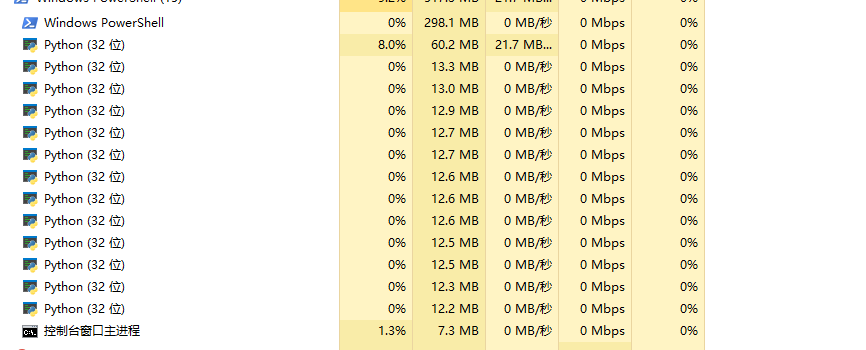

1.爬取页面的部分开启了进程池，程序直接在pycharm中运行，但是发现，下载5、6万个页面后，整个程序就会卡住。

我感觉是pycharm本身的限制，而且pycharm里面编辑也会变卡。

每次都是重新载入要下载的列表。

然后这次只剩8000多个url需要下载了。但是运行一段时间后就变得很慢，十几个进程感觉实际上就只有一个在运行的样子。

本来1秒down几十个网页，现在一秒一个都费劲。

下次爬这种大项目直接用控制台运行看看会不会有问题。

这是第二次

刚才试着用一下360加速球，这几个进程的内存占用直接变成0了

最终结果是卡住了，一个进程都不会动了

这次我要用powershell命令行直接跑了

数据爬完了，进入数据清理阶段了

进程池在任务完成后好像不会主动把那些进程关掉。

因为我是把整理到的信息不断push到一个列表中，所以现在主进程内存占用不断增加。

最终可能会有几百m到几gb，不知道我这电脑能不能hold住。

十几万条数据的占用最后只有300mb不到，不如chrome随便用占用的多：

最终结果生成一个266mb的json文件，而且几乎瞬间生成。列表中的内容全部保存到txt文本有144mb。

结论是，看来python爬虫爬10万级别的数据随便写不会有什么问题，跟我之前想的差不多。

下载下来的全部有效的html 10g多。

改天研究一下sqlite，把有用的消息都存到数据库中。包括图片链接也要重新下载一下。